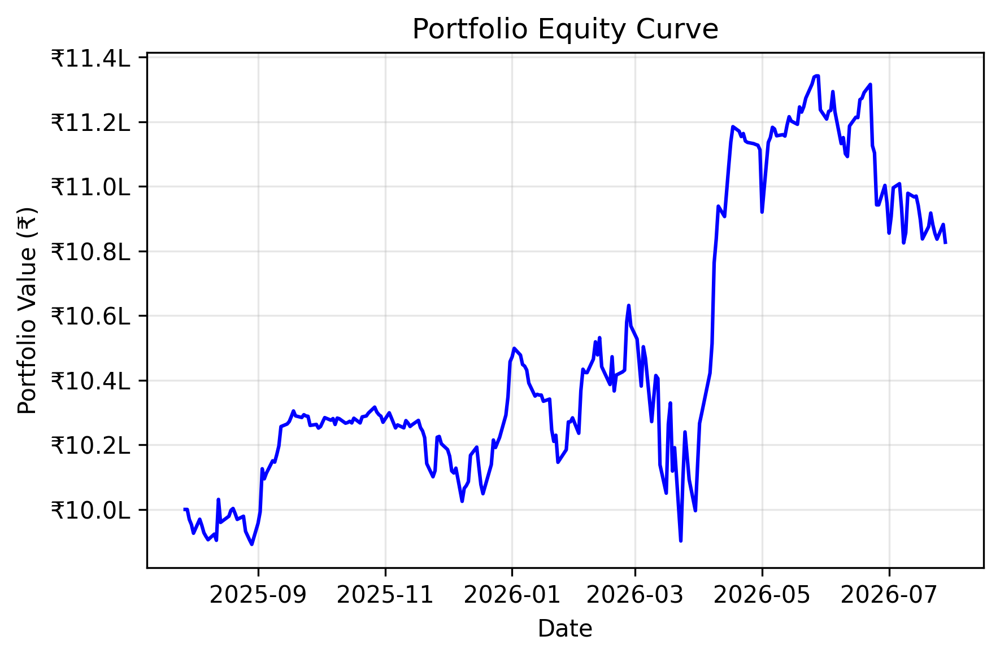
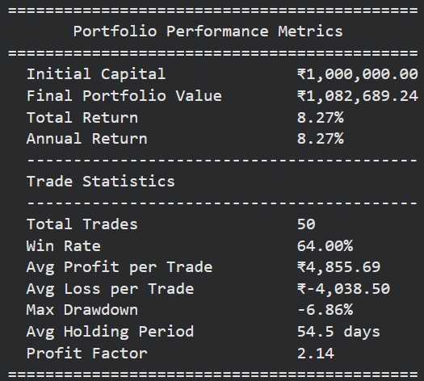
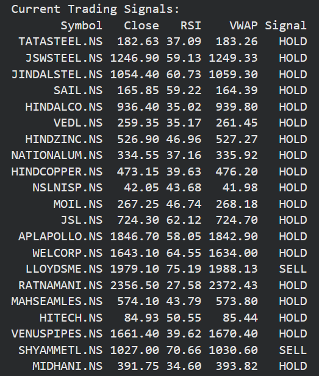
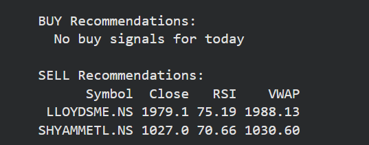

# Automated Trading Signal & Backtesting Framework

A Python-based framework for automated trading signal generation, T+1 strategy backtesting, portfolio performance evaluation, and CSV export using an RSI-VWAP trading strategy. 

This project demonstrates the use of an RSI-VWAP trading strategy on 21 metal and metal-related stocks listed on the National Stock Exchange (NSE). The main purpose isn't to identify the most profitable strategy, but rather to automate the repetitive process of technical strategy backtesting and performance evaluation.

---

## Project Overview

Evaluating technical trading strategies manually often involves:

- Inspecting historical price charts
- Recording trades in spreadsheets
- Calculating returns and performance metrics manually
- Repeating the same process for multiple stocks

While manageable for a few trades, this process quickly becomes time-consuming, error-prone, difficult to reproduce, and inefficient while dealing with a large number of stocks.

This project automates the complete workflow, from retrieving market data and signal generation to backtesting, portfolio evaluation, and generating csv exports of trade history and signals.

The objective of this project isn't demonstrating a market-beating trading strategy, but rather **workflow automation**.

---

## Motivation

During my internship, I noticed that backtesting a trading strategy frequently involved manually reviewing historical charts, identifying entry and exit points, and recording trades in spreadsheets for every stock.

So instead of spending hours repeating the same process for every stock, I wanted to automate the entire workflow into a reusable Python framework capable of:

- Retrieving historical market data
- Generating trading signals automatically
- Executing realistic T+1 backtests
- Evaluating portfolio performance
- Exporting trading signals and trade history

---

## Key Features

- Automatically retrieves historical market data using Yahoo Finance
- Technical indicator calculation (RSI and VWAP)
- Rule-based BUY and SELL signal generation
- Realistic **T+1** trade execution
- Portfolio-level backtesting
- Daily mark-to-market portfolio valuation
- Automatic CSV export of trading signals
- Automatic CSV export of trade history
- Portfolio performance visualization
- Portfolio and trade-level performance metrics

---

## Strategy Logic

The current implementation demonstrates the framework using a simple **RSI + VWAP** strategy.

### Buy Signal

- RSI < 30
- Closing Price > VWAP

### Sell Signal

- RSI > 70
- Closing Price < VWAP

### Trade Execution

Trading signals are generated after the market closes on **Day T**.

Trades are executed at the **opening price of Day T+1**, avoiding look-ahead bias and providing a more realistic simulation of trade execution.

---

## Workflow

```
Yahoo Finance
        │
        ▼
Historical OHLCV Data
        │
        ▼
Technical Indicator Calculation
(RSI + VWAP)
        │
        ▼
Trading Signal Generation
        │
        ▼
T+1 Trade Execution
        │
        ▼
Portfolio Construction
        │
        ▼
Portfolio Performance Evaluation
        │
        ▼
CSV Exports & Visualization
```

---

## Performance Metrics

### Portfolio Metrics

- Initial Capital
- Final Portfolio Value
- Total Return
- Annual Return

### Trade Metrics

- Total Trades
- Win Rate
- Average Profit per Trade
- Average Loss per Trade
- Max. Drawdown
- Average Holding Period
- Profit Factor

---

## Output Files

The framework automatically generates the following outputs:

| File | Description |
|------|-------------|
| `signals.csv` | Current BUY / SELL / HOLD signals |
| `trade_history.csv` | Complete trade log with entry, exit, P&L, and holding period |
| `Portfolio_Value.png` | Portfolio equity curve |

These outputs can be used for additional analysis, visualization, or integration into other trading workflows.

---
---

## Sample Outputs

The following screenshots show sample outputs generated by the framework during a backtest.

### Portfolio Equity Curve



The framework tracks the portfolio's daily value throughout the backtest and visualizes the resulting equity curve, allowing strategy performance to be evaluated over time.

---

### Portfolio Performance Metrics



At the end of each backtest, the framework automatically calculates key portfolio and trade-level performance metrics, including returns, win rate, drawdown, holding period, and profit factor.

---

### Trading Signals



For every stock in the portfolio, the framework computes the technical indicators and generates BUY, SELL, or HOLD signals based on the predefined strategy rules.

---

### Actionable Trading Signals



To make the output easier to interpret, actionable BUY and SELL recommendations are also presented separately, allowing users to quickly identify potential trading opportunities.

## Technologies Used

| Technology | Purpose |
|------------|---------|
| Python | Core programming language |
| Pandas | Data manipulation and analysis |
| NumPy | Numerical computations |
| Matplotlib | Portfolio visualization |
| yfinance | Historical market data retrieval |
| datetime | Historical date range management |

---

## Assumptions & Limitations

| Category | Current Implementation |
|-----------|------------------------|
| RSI | 14-period Simple Moving Average (SMA) implementation |
| VWAP | Daily approximation using daily OHLCV data |
| Execution | Signal generated on Day T, executed on Day T+1 Open |
| Position Type | Long-only |
| Capital Allocation | Equal-weight across all stocks |
| Shares | Whole shares only |
| Portfolio Valuation | Daily mark-to-market using closing prices |
| Transaction Costs | Not included |
| Taxes | Not included |
| Slippage | Not included |
| Portfolio Rebalancing | None |
| Data Source | Yahoo Finance (`yfinance`) |

---

## Repository Structure

```
Automated-Trading-Signal-Backtesting-Framework/
│
├── trading_framework.py
├── README.md
├── requirements.txt
├── LICENSE
│
├── outputs/
│   ├── signals.csv
│   ├── trade_history.csv
│   └── Portfolio_Value.png
│
└── images/
    ├── portfolio_performance.png
    ├── trading_signals.png
    └── terminal_output.png
```

---

## Future Improvements

Potential extensions include:

- Wilder's RSI implementation
- Intraday VWAP using minute-level market data
- Additional technical indicators (MACD, ADX, Bollinger Bands, Supertrend)
- Multi-factor trading strategies
- Position sizing and risk management
- Portfolio rebalancing
- Transaction cost and slippage modelling
- Benchmark comparison against market indices
- Hyperparameter optimization
- Walk-forward analysis
- Interactive dashboard using Streamlit

---

## Disclaimer

This project has been developed for educational and research purposes only.

The trading strategy included in this repository is intended solely to demonstrate the capabilities of the automated backtesting framework and should not be interpreted as financial advice or a recommendation to buy or sell any security.

